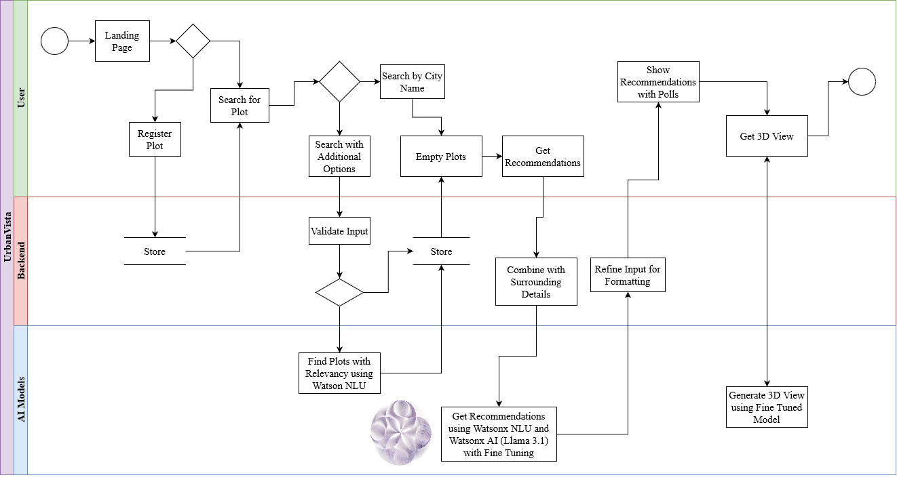
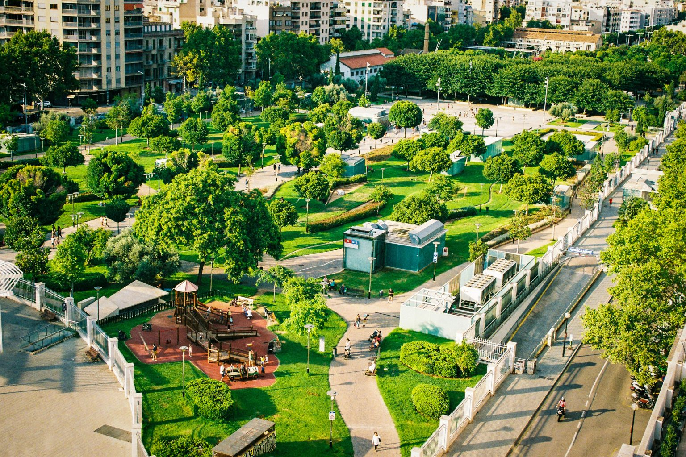
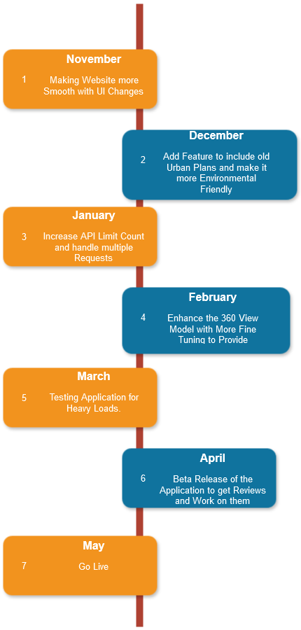

# UrbanVista: AI-Powered Urban Planning and Plot Registration

[](https://www.apache.org/licenses/LICENSE-2.0)  
[](https://developer.ibm.com/callforcode/solutions/projects/get-started/)

## Project Summary

### The issue we are hoping to solve
Current urban infrastructure suffers from poor planning, leading to inefficient land use and missed opportunities for development. Traditional urban planning methods often rely on outdated data and models that cannot dynamically adjust to growing urban areas.

### How our technology solution can help
UrbanVista leverages AI-driven insights to analyze empty plots across entire cities or specific locations, providing recommendations on optimal land usage based on factors such as climate, population density, and nearby resources. By using real-time satellite imagery and AI recommendations, UrbanVista offers a comprehensive solution to urban planning inefficiencies.

### Our idea
UrbanVista uses IBM Watsonx for natural language understanding (NLU) and recommendation generation. Users can search for empty plots in any city and receive AI-based suggestions on how to develop the land in a way that aligns with environmental and infrastructural goals. Users can also view immersive 3D visualizations of the selected plots using technologies like NeRF or instant NeRFs, enhancing the decision-making process.


## Technology Implementation

### IBM Watsonx product(s) used
- **IBM Watsonx NLU**: For processing user queries and generating place-specific recommendations based on various factors such as climate, nearby amenities, and population data.
- **IBM Watsonx.ai**: For backend processing, generating personalized land usage recommendations based on the analysis of geographical and socio-economic factors.

### Other technologies used
- **Python**: Backend development and integration with various APIs for data processing.
- **Custom Fine-tuned Model**: A proprietary model fine-tuned for generating 3D visualizations of plots based on recommendations.
- **Next.js**: Frontend framework used for building a seamless user interface.
- **MongoDB**: Database for storing user-submitted plots and other relevant data such as user-registered plots, plot details, and recommendations.

### Key Features
1. **Weather Dashboard**: Displays the current climate and 5-day weather forecast for a selected location using visually appealing graphs.
2. **Geographical Data**: Provides detailed geographical information about a selected country, including water reserves, rivers, forests, and national parks.
3. **Plot Registration**: Allows logged-in users to mark empty plots on a map and submit relevant images or videos. These plots are stored in a database and can be viewed and rated by other users.
4. **AI-Based Recommendations**: Based on factors like climate, population, and nearby amenities, UrbanVista offers recommendations for how to best utilize available land.
5. **3D Visualization**: NeRF/instant NeRF-based visualizations give users an immersive, real-time view of the plot, helping them make informed decisions about land use.

### Solution architecture

Diagram and step-by-step description of the flow of our solution:




### Solution demo video

[](https://youtu.be/vOgCOoy_Bx0)


### Project development roadmap

In the future we plan to...

See below for our proposed schedule on next steps after Call for Code 2024 submission.



## How to Run the Project

1. Clone the repository.
2. Install dependencies:
```bash
   pip install -r requirements.txt
   npm install
   ```
3. Set up MongoDB and IBM Watsonx API credentials in your environment.
4. Run the development servers:
```bash
   npm run dev
   python backend.py
   ```
5. Access the frontend at localhost:3000 and explore features like plot search, weather dashboard, and 3D visualizations. 